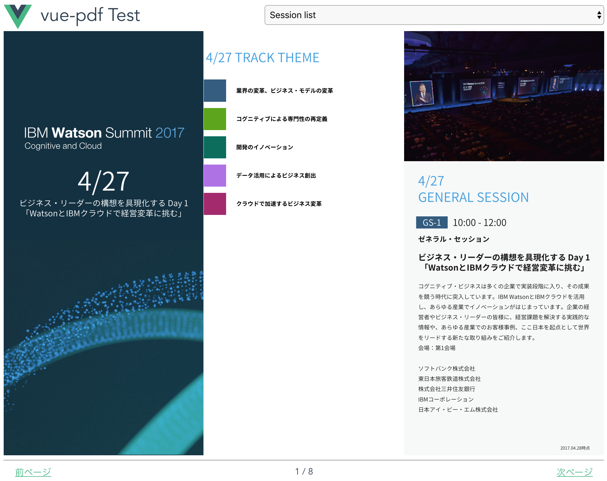

# vue-pdf-test

## はじめに
vue.js で PDF を表示するモジュール `vue-pdf` がありましたので、簡単な検証をしました。

## Build Setup

``` bash
# install dependencies
npm install

# serve with hot reload at localhost:8080
npm run dev

# build for production with minification
npm run build

# build for production and view the bundle analyzer report
npm run build --report

# run unit tests
npm run unit

# run e2e tests
npm run e2e

# run all tests
npm test
```

For a detailed explanation on how things work, check out the [guide](http://vuejs-templates.github.io/webpack/) and [docs for vue-loader](http://vuejs.github.io/vue-loader).

## 画面イメージ


## 感想
* PDF の表示はできますが、ページ移動などプログラムによる制御が必要です。
* コピペや検索はできないようです。
* 簡単な検証 (0.5d) のつもりだったので CSS を手組みましたが、とても面倒です。やはり Bootstrap や Element-UI を組込むべきでした。

## 参考
* https://www.npmjs.com/package/vue-pdf
* https://jp.vuejs.org/v2/guide/forms.html#%E9%81%B8%E6%8A%9E
